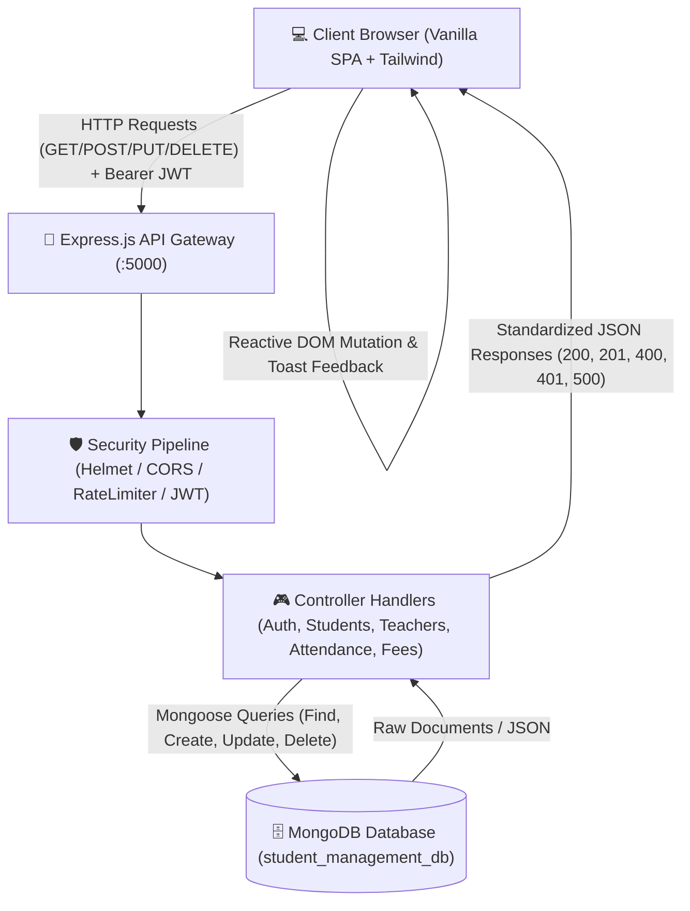

# 📖 Student Management System (StudentMS) — Full Technical Documentation

A comprehensive full-stack technical specification, system architecture, database design, API reference, and module guide for **StudentMS**.

---

## 📑 Table of Contents
1. [Project Overview](#1-project-overview)
2. [Technology Stack](#2-technology-stack)
3. [System Architecture & Data Flow](#3-system-architecture--data-flow)
4. [Project Directory Structure](#4-project-directory-structure)
5. [Core Functional Modules](#5-core-functional-modules)
6. [Design System & Tailwind CSS Integration](#6-design-system--tailwind-css-integration)
7. [Database Schemas & Data Models](#7-database-schemas--data-models)
8. [RESTful API Reference](#8-restful-api-reference)
9. [Authentication & Security Architecture](#9-authentication--security-architecture)
10. [Troubleshooting & FAQs](#10-troubleshooting--faqs)

---

## 1. Project Overview

**StudentMS** is an institutional-grade, full-stack web application designed for universities, colleges, and training academies. It centralizes student information, faculty allocations, daily roll-call attendance, classroom schedules, examination dates, tuition fee invoices, and institutional analytics into a single responsive Single Page Application (SPA).

### Key Architectural Strengths:
* **Decoupled Architecture**: Express RESTful JSON API backend serving a Vanilla ES6+ SPA frontend.
* **Dual Theme Engine**: High-contrast Dark Plum/Charcoal palette (`#181216` / `#0F0F11`) with an instant Light Mode toggle (`#f1f5f9` / `#ffffff`).
* **Tailwind CSS Utility Integration**: Blended utility layer allowing rapid styling with exact brand color token preservation.
* **Resilient Offline/Demo Fallback**: Graceful local state fallbacks when MongoDB or network connections are unavailable.
* **Enterprise Security**: JWT stateless tokens, bcrypt (salt rounds 10) password encryption, rate-limiting, and Helmet HTTP security headers.

---

## 2. Technology Stack

| Layer | Technologies & Libraries | Purpose |
| :--- | :--- | :--- |
| **Backend Runtime** | Node.js (v18+) | Server-side JavaScript execution environment |
| **Web Framework** | Express.js (v5.x) | Routing, middleware orchestration, and HTTP request handling |
| **Database** | MongoDB & Mongoose ODM (v9.x) | Document-oriented NoSQL database and schema modeling |
| **Authentication** | JSON Web Tokens (`jsonwebtoken`), `bcryptjs` | Stateless session management and password hashing |
| **Security & Utilities** | `helmet`, `cors`, `express-rate-limit`, `dotenv` | Header hardening, CORS policies, rate limiting, and config loading |
| **Frontend Core** | HTML5, Vanilla JavaScript (ES6+ SPA) | Zero-build fast browser execution, DOM manipulation, and state management |
| **Styling & UI** | Tailwind CSS (CDN Engine) + Vanilla CSS3 | Utility-first styling combined with custom design tokens & glassmorphism |
| **Icons & Typography** | FontAwesome 6, Google Fonts (`Inter`, `Outfit`) | Vector icons and modern typography |

---

## 3. System Architecture & Data Flow



### Request Lifecycle:
1. **User Action**: The client triggers a view switch or form submission via `app.js` or `auth.js`.
2. **Token Injection**: If authenticated, the client automatically attaches the `Authorization: Bearer <JWT_TOKEN>` header.
3. **Security Screening**: Express routes requests through `helmet` headers, CORS checks, and `authLimiter` rate-limiting.
4. **Controller Execution**: Dedicated controller functions validate request bodies, handle business logic, and invoke Mongoose models.
5. **Database Interaction**: Mongoose performs MongoDB operations and returns structured data.
6. **Safe Client Parsing**: `parseApiResponse()` validates `Content-Type: application/json` before updating UI state, preventing HTML syntax errors.

---

## 4. Project Directory Structure

```text
STUDENT MANAGEMENT APP/
├── Backend/
│   ├── config/
│   │   └── db.js                 # MongoDB connection handler
│   ├── controllers/
│   │   ├── authController.js     # User registration, login, profile, and account deletion
│   │   ├── studentController.js  # Student CRUD operations and search filtering
│   │   ├── teacherController.js  # Faculty directory management
│   │   ├── attendanceController.js # Daily roll-call attendance logger
│   │   └── feeController.js      # Tuition fee invoice and payment tracking
│   ├── middleware/
│   │   ├── errorHandler.js       # Centralized 500 error handling middleware
│   │   └── requireAuth.js        # JWT verification and user existence middleware
│   ├── models/
│   │   ├── User.js               # User account schema with bcrypt pre-save hashing
│   │   ├── Student.js            # Student profile schema
│   │   ├── Teacher.js            # Faculty instructor schema
│   │   ├── Attendance.js         # Daily attendance roll-call schema
│   │   └── Fee.js                # Tuition invoice and payment status schema
│   ├── routes/
│   │   ├── authRoutes.js         # Authentication routes (/auth/register, /auth/login)
│   │   ├── studentRoutes.js      # Student routes (/students)
│   │   ├── teacherRoutes.js      # Teacher routes (/teachers)
│   │   ├── attendanceRoutes.js   # Attendance routes (/attendance)
│   │   └── feeRoutes.js          # Fee invoice routes (/fees)
│   ├── .env                      # Backend environment variables
│   ├── .env.example              # Environment variable template
│   └── server.js                 # Main Express application entry point
├── Frontend/
│   ├── assets/
│   │   ├── css/
│   │   │   └── styles.css        # Master design system & Tailwind utility extensions
│   │   └── js/
│   │       ├── app.js            # Single Page Application core engine
│   │       └── auth.js           # Client login & registration script
│   ├── pages/
│   │   ├── login.html            # Dedicated Sign In view
│   │   └── register.html         # Dedicated Student Registration view
│   └── index.html                # Main SPA application shell
├── .gitignore                    # Git ignore definitions
├── documentation.md              # Complete technical documentation (this file)
├── package.json                  # Root project scripts and dependencies
├── README.md                     # Setup and quick-start instructions
├── run.bat                       # 1-Click launcher shortcut
└── start-app.bat                 # Windows batch launcher (Starts server & opens browser)
```

---

## 5. Core Functional Modules

### 5.1 Dashboard Overview (`#view-dashboard`)
* Real-time metric cards: Total Enrolled Students, Active Count, Inactive Count, Course Program Count.
* Weekly Attendance Trend visual bar chart.
* Tuition Fee Collection summary progress bar.
* Quick student directory preview with instant status badges.

### 5.2 Student Directory (`#view-students`)
* Full CRUD (Create, Read, Update, Delete) for student profiles.
* Debounced live search filtering by name, email, or course program.
* Course program filter dropdown (All, Computer Science, Data Science, Cyber Security, etc.).
* Smart client-side pagination (10 records per page).

### 5.3 Faculty & Teachers (`#view-teachers`)
* Instructor profiles with avatar badges, assigned subject, department lead tags, email, and office hours.
* Add New Faculty modal dialog with instant database persistence.
* Departmental overview stat cards.

### 5.4 Classes & Sections (`#view-classes`)
* Interactive classroom section cards displaying instructor assignments, room numbers, and buildings.
* Capacity utilization visual progress bars (e.g., `42 / 50 Students` enrolled).
* Quick action shortcuts to view enrolled class lists.

### 5.5 Daily Attendance Roll-Call (`#view-attendance`)
* Interactive date picker (`input[type="date"]`) loading daily records on change.
* Real-time presence counters (Present, Absent, Late count cards).
* High-contrast radio pill status toggles (Green: Present, Red: Absent, Amber: Late) with optional remarks.
* Bulk Save Roll Call action syncing records to MongoDB.

### 5.6 Timetable & Schedule (`#view-timetable`)
* Weekly schedule matrix mapping lecture hours (Monday to Friday).
* Visual course pills with room assignments (Room 302, Cyber Lab, Hall B).
* 1-click **Print Schedule** browser dialogue.

### 5.7 Examination Schedules (`#view-exams`)
* Upcoming test schedule cards with course title, date, time window, and exam hall location.
* Exam weightage tags (e.g., `30% of Final Grade`, `40% of Final Grade`).
* Download Exam Guidelines syllabus shortcut.

### 5.8 Tuition Fees & Payments (`#view-fees`)
* Tuition financial summary cards: Fees Collected, Pending Dues, Collection Rate percentage.
* Filterable invoice table showing total amount, paid amount, due balance, and status badges (`Paid`, `Partial`, `Pending`).
* Create Fee Invoice modal and official printable payment receipt generator.

### 5.9 Reports & Exporting (`#view-reports`)
* 1-Click **Export to CSV**: Generates spreadsheet file with complete student enrollment data.
* 1-Click **Export to PDF**: Formats data into a clean, printable administrative PDF report.

### 5.10 Profile & Settings (`#view-settings`)
* View student profile session details (Name, Email, Course, Role).
* Account deletion with automatic JWT revocation and session cleanup.

---

## 6. Design System & Tailwind CSS Integration

### Exact Color Tokens:
```css
/* Dark Theme (Default) */
--bg-primary: #181216;             /* Primary Dark Plum Background */
--bg-secondary: #0F0F11;           /* Container & Sidebar Charcoal */
--bg-card: rgba(15, 15, 17, 0.85); /* Card Glassmorphism Surface */
--text-main: #EAEAEA;              /* High-Contrast Off-White Text */
--text-muted: #9D7E8F;             /* Rose Muted Accent & Subtitles */
--border-color: rgba(157, 126, 143, 0.22); /* Border Plum Accent */
--accent-primary: #9D7E8F;          /* Primary Plum Accent */

/* Light Theme */
--bg-primary: #f1f5f9;
--bg-secondary: #ffffff;
--bg-card: rgba(255, 255, 255, 0.85);
--text-main: #0f172a;
--text-muted: #475569;
```

### Tailwind Configuration:
Tailwind CSS is injected via the official Tailwind CDN engine in `<head>` with custom color bindings:
* `bg-brand-bg` -> `#181216`
* `bg-brand-secondary` -> `#0F0F11`
* `bg-brand-card` -> `rgba(15, 15, 17, 0.85)`
* `text-brand-accent` -> `#9D7E8F`
* `border-brand-color` -> `rgba(157, 126, 143, 0.22)`
* `darkMode: ['selector', '[data-theme="dark"]']`
* `corePlugins: { preflight: false }` ensures existing custom component borders, buttons, and form inputs are never stripped by generic browser resets.

---

## 7. Database Schemas & Data Models

### 7.1 User Schema (`Backend/models/User.js`)
| Field | Type | Attributes | Description |
| :--- | :--- | :--- | :--- |
| `name` | String | Required, Trimmed | Full name of user |
| `email` | String | Required, Unique, Lowercase | User email address |
| `password` | String | Required, Min 6 chars | Bcrypt hashed password |
| `course` | String | Default: `"General Studies"` | Academic program |
| `role` | String | Enum: `["student", "admin"]` | Access privilege level |
| `timestamps`| Date | Auto-generated | `createdAt`, `updatedAt` |

### 7.2 Student Schema (`Backend/models/Student.js`)
| Field | Type | Attributes | Description |
| :--- | :--- | :--- | :--- |
| `name` | String | Required, Trimmed | Student full name |
| `email` | String | Required, Unique | Academic email |
| `course` | String | Required | Enrolled program |
| `enrollmentDate`| String | Required | Date of admission |
| `status` | String | Enum: `["active", "inactive"]` | Academic standing |

### 7.3 Teacher Schema (`Backend/models/Teacher.js`)
| Field | Type | Attributes | Description |
| :--- | :--- | :--- | :--- |
| `name` | String | Required | Instructor name |
| `email` | String | Required | Contact email |
| `department` | String | Required | Academic department |
| `subject` | String | Required | Primary assigned course |
| `phone` | String | Optional | Contact phone number |
| `officeHours` | String | Default: `"Mon-Fri 10:00 AM - 4:00 PM"` | Availability window |

### 7.4 Attendance Schema (`Backend/models/Attendance.js`)
| Field | Type | Attributes | Description |
| :--- | :--- | :--- | :--- |
| `student` | ObjectId | Ref: `"Student"` | Linked student ID |
| `studentName` | String | Optional | Cached student name |
| `date` | String | Required | Date string (`YYYY-MM-DD`) |
| `status` | String | Enum: `["present", "absent", "late"]` | Attendance marker |
| `remarks` | String | Optional | Notes or reason |

### 7.5 Fee Schema (`Backend/models/Fee.js`)
| Field | Type | Attributes | Description |
| :--- | :--- | :--- | :--- |
| `studentName` | String | Required | Student full name |
| `course` | String | Required | Course program |
| `totalFee` | Number | Required | Total tuition due |
| `paidAmount` | Number | Default: `0` | Amount paid to date |
| `dueDate` | String | Required | Payment due date |
| `status` | String | Enum: `["paid", "partial", "pending"]` | Invoice status |

---

## 8. RESTful API Reference

### 8.1 Authentication Endpoints (`/auth`)

#### `POST /auth/register` (or `/auth/signup`)
* **Access**: Public
* **Request Body**:
  ```json
  {
    "name": "Sarah Smith",
    "email": "sarah.smith@university.edu",
    "course": "Computer Science",
    "password": "password123"
  }
  ```
* **Response (201 Created)**:
  ```json
  {
    "token": "eyJhbGciOiJIUzI1NiIsInR5cCI6IkpXVCJ9...",
    "user": {
      "_id": "6ac92116d8fd525171141afb",
      "name": "Sarah Smith",
      "email": "sarah.smith@university.edu",
      "course": "Computer Science",
      "role": "student"
    }
  }
  ```

#### `POST /auth/login` (or `/auth/signin`)
* **Access**: Public
* **Request Body**:
  ```json
  {
    "email": "sarah.smith@university.edu",
    "password": "password123"
  }
  ```
* **Response (200 OK)**: Returns JWT bearer token and user object.

#### `GET /auth/me`
* **Access**: Protected (`Bearer <TOKEN>`)
* **Response (200 OK)**: Returns current authenticated user record without password.

#### `DELETE /auth/account`
* **Access**: Protected (`Bearer <TOKEN>`)
* **Response (200 OK)**: Permanently removes user account and invalidates session token.

---

### 8.2 Student Management Endpoints (`/students`)

| Method | Endpoint | Description | Protected |
| :--- | :--- | :--- | :--- |
| `GET` | `/students` | Retrieve all student records | No |
| `GET` | `/students/:id` | Retrieve single student profile | No |
| `POST` | `/students` | Add a new student record | Yes |
| `PUT` | `/students/:id` | Update existing student record | Yes |
| `DELETE` | `/students/:id` | Remove student record | Yes |

---

### 8.3 Faculty Endpoints (`/teachers`)

| Method | Endpoint | Description | Protected |
| :--- | :--- | :--- | :--- |
| `GET` | `/teachers` | Retrieve all faculty members | No |
| `POST` | `/teachers` | Add a new teacher profile | Yes |
| `DELETE` | `/teachers/:id` | Remove a teacher profile | Yes |

---

### 8.4 Attendance Endpoints (`/attendance`)

| Method | Endpoint | Description | Protected |
| :--- | :--- | :--- | :--- |
| `GET` | `/attendance?date=YYYY-MM-DD` | Retrieve roll-call attendance by date | No |
| `POST` | `/attendance` | Save daily roll-call attendance records | Yes |

---

### 8.5 Fee Management Endpoints (`/fees`)

| Method | Endpoint | Description | Protected |
| :--- | :--- | :--- | :--- |
| `GET` | `/fees` | Retrieve all tuition fee invoices | No |
| `POST` | `/fees` | Create a new fee invoice record | Yes |

---

## 9. Authentication & Security Architecture

1. **Stateless JWT Tokens**:
   - Signed using `HS256` algorithm with `process.env.JWT_SECRET`.
   - Token payload: `{ id: user._id }`.
   - Standard 7-day expiration (`JWT_EXPIRES_IN=7d`).
2. **Password Cryptography**:
   - `bcryptjs` with salt round factor 10.
   - Passwords are automatically hashed in the Mongoose `pre("save")` hook before writing to disk.
   - Passwords are never returned in JSON response bodies (`select("-password")`).
3. **Helmet Security**:
   - Cross-Origin Resource Policy and frameguard protection enabled.
   - CSP configured for script and style CDN integration.
4. **Rate Limiting**:
   - `express-rate-limit` guards `/auth/*` endpoints against brute-force attacks (100 requests per 15 minutes per IP).
5. **Safe Response Parsing**:
   - Frontend `parseApiResponse()` inspects the HTTP `Content-Type` header before parsing JSON to prevent crashes from raw HTML 404/500 error pages.

---

## 10. Troubleshooting & FAQs

### Q: Why did registration fail with "Unexpected token '<', <!DOCTYPE... is not valid JSON"?
* **Cause**: In older Mongoose versions, `async` pre-save hooks received `next()`, causing `TypeError: next is not a function`. The server returned an HTML error page, which crashed client-side JSON parsing.
* **Resolution**: The pre-save hook in `Backend/models/User.js` has been updated to modern Mongoose syntax without `next()`. Routes now support both `/register` and `/signup`.

### Q: Can the application run if MongoDB is temporarily offline?
* **Yes**: The frontend SPA includes resilient demo storage fallbacks that cache and render demo student records from browser `localStorage` if the backend connection is interrupted.

### Q: How do I change the port or database URL?
* Edit `Backend/.env`:
  ```env
  PORT=5000
  MONGO_URI=mongodb://127.0.0.1:27017/student_management_db
  JWT_SECRET=your_custom_secret
  ```
