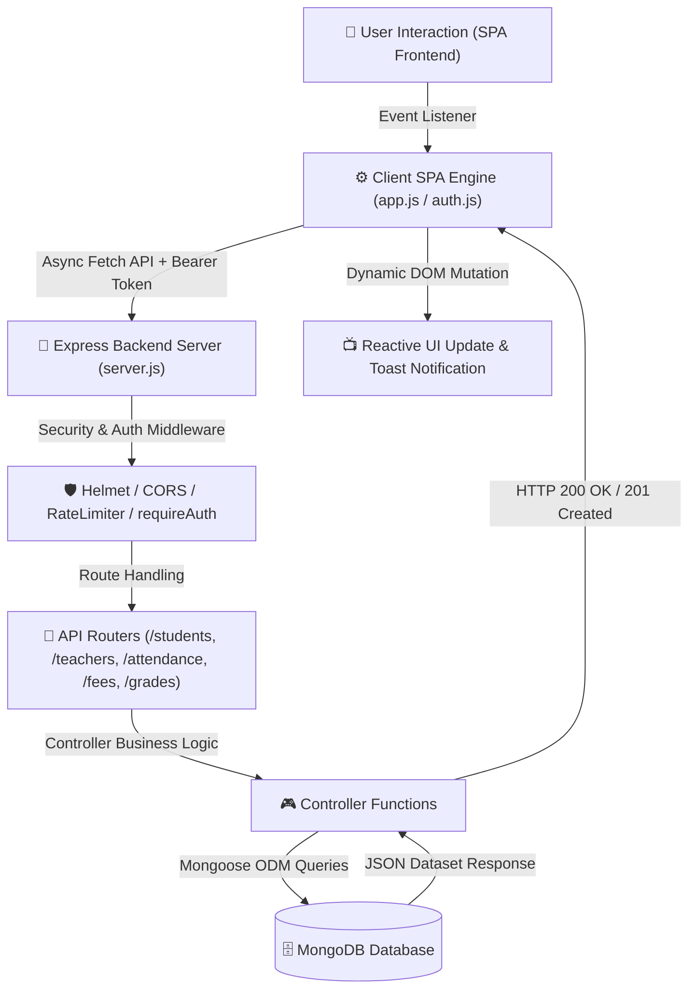

# 🎓 Student Management System (StudentMS)

A full-stack, production-ready **Student Management Application** built with **Node.js, Express, MongoDB**, and a high-performance **Vanilla JS & CSS Single Page Application (SPA)** frontend.


---

## 🌟 Key Features & Modules

### 💻 Frontend (Single Page Application)
* **📊 Real-Time Dashboard**: Interactive metric counters for total enrolled students, active/inactive statuses, course program totals, weekly attendance charts, and tuition fee progress.
* **👩‍🏫 Faculty & Teacher Directory**: Full CRUD management for teachers, assigned subjects, department leads, and office hours.
* **📝 Daily Attendance Roll-Call**: Interactive date picker with Present, Absent, and Late radio markers updating real-time presence counters.
* **💳 Tuition Fee Invoices & Receipts**: Track tuition dues, log payments, and generate printable official payment receipts.
* **📈 Exam Marks & Auto-GPA Calculator**: Enter subject exam scores, auto-calculate letter grades (A+, A, B, C, D, F) and cumulative GPA out of 4.0, with printable grade marksheets.
* **📊 Report Exporting**: 1-click Export to CSV spreadsheet or printable PDF report.
* **🔍 Live Debounced Search**: Fast filtering by student name, email, or course program.
* **🎨 Modern Responsive UI**: High-contrast dark charcoal design system with glassmorphism, off-canvas mobile drawer, and light/dark theme persistence.

### ⚙️ Backend (RESTful API & Database)
* **🔐 Authentication**: JWT (JSON Web Tokens) with password hashing via `bcryptjs`.
* **🛑 Rate Limiting & Security**: Rate-limited authentication routes with `helmet` and `cors` security headers.
* **🗄️ MongoDB Database**: Mongoose schemas for Students, Teachers, Attendance, Fees, Grades, and Users.

---

## 🛠️ Technology Stack

| Layer | Technology |
| :--- | :--- |
| **Backend Framework** | Node.js, Express.js |
| **Database & ODM** | MongoDB, Mongoose ODM |
| **Authentication** | JSON Web Token (JWT), bcryptjs |
| **Security & Utilities** | Helmet, CORS, Express-Rate-Limit |
| **Frontend Core** | Vanilla JavaScript (ES6+), HTML5 |
| **Styling & Design** | Vanilla CSS3 (CSS Variables, Flexbox, Grid, Glassmorphism) |

---

## 🔄 Project Execution Workflow



### 1. Client-Side User Action & View Switching
- The user launches the application via `index.html` or direct routes (`/login`, `/register`).
- Single Page Application (SPA) navigation is handled seamlessly in `app.js` via `switchView()`, toggling dynamic `<section>` visibility without full browser reloads.

### 2. Async API Dispatch & JWT Bearer Token Injection
- When performing CRUD operations (e.g., adding a student, logging attendance, recording exam marks, or creating fee invoices), `app.js` triggers asynchronous `fetch()` requests.
- Active session tokens (`sms_token`) stored in `localStorage` are automatically attached to HTTP request headers:
  ```http
  Authorization: Bearer <JWT_TOKEN>
  Content-Type: application/json
  ```

### 3. Backend Security & Route Middleware Processing
- Incoming requests arrive at `Backend/server.js`.
- Security policies are enforced instantly:
  - `helmet`: Sets HTTP security headers (CSP, CORS, frame options).
  - `express-rate-limit`: Prevents brute-force attempts on sensitive authentication endpoints (`/auth/login`, `/auth/register`).
  - `requireAuth`: Validates JWT signatures and verifies user session state.

### 4. Controller Logic & Database Persistence
- Verified requests route to dedicated Express controllers:
  - `studentController.js` for student directory management.
  - `teacherController.js` for faculty & department lead allocations.
  - `attendanceController.js` for daily roll-call attendance logs.
  - `feeController.js` for tuition invoices and printable payment receipts.
  - `gradeController.js` for automatic letter grade evaluation & GPA calculations.
- Controllers interface with MongoDB using Mongoose schemas (`Student`, `Teacher`, `Attendance`, `Fee`, `Grade`, `User`).

### 5. Reactive DOM Mutation & User Notifications
- The API returns structured JSON responses (e.g., `200 OK` or `201 Created`).
- `app.js` updates reactive state arrays, re-renders data tables/cards/charts dynamically, and displays high-contrast toast notifications.

---

## 📥 Installation

### Prerequisites
* **Node.js** (v18.0.0 or higher)
* **MongoDB** (Running locally on `mongodb://127.0.0.1:27017` or MongoDB Atlas)

### Step 1: Clone or Open Project
Navigate to the root project folder in your terminal:

```bash
cd "STUDENT MANAGEMENT APP"
```

### Step 2: Install Backend Dependencies
Install all required Node.js packages in the `Backend/` directory:

```bash
cd Backend
npm install
cd ..
```

### Step 3: Configure Environment Variables
Create or verify the `.env` file in `Backend/.env`:

```env
PORT=5000
MONGO_URI=mongodb://127.0.0.1:27017/student_management_db
JWT_SECRET=supersecretjwtkey_student_management_2026
JWT_EXPIRES_IN=7d
```

---

## 🚀 Running the Application

### Method 1: 1-Click Launcher (Windows Batch Script)
Simply double-click **`start-app.bat`** or **`run.bat`** in File Explorer!
- Starts the Express backend server on `http://localhost:5000`.
- Automatically opens `http://localhost:5000` in your default browser.

```powershell
.\start-app.bat
```

### Method 2: Command Line (Node.js)
Start the Express server directly via Node:

```bash
node Backend/server.js
```

Or using Nodemon (for development hot-reloading):

```bash
cd Backend
npm run dev
```

Open your browser at:
👉 **`http://localhost:5000`**

---

## 📡 API Reference

### Core Module Endpoints

| Method | Endpoint | Description | Access |
| :--- | :--- | :--- | :--- |
| `GET` | `/students` | Fetch all student records | Public |
| `POST` | `/students` | Create a new student record | Protected |
| `PUT` | `/students/:id` | Update student profile | Protected |
| `DELETE` | `/students/:id` | Delete student record | Protected |
| `GET` | `/teachers` | Fetch all faculty teachers | Public |
| `POST` | `/teachers` | Add a new teacher | Protected |
| `DELETE` | `/teachers/:id` | Remove a teacher record | Protected |
| `GET` | `/attendance` | Fetch attendance records by date | Public |
| `POST` | `/attendance` | Log daily attendance roll-call | Protected |
| `GET` | `/fees` | Fetch tuition fee invoices | Public |
| `POST` | `/fees` | Create fee invoice | Protected |
| `GET` | `/grades` | Fetch exam marks & calculated GPAs | Public |
| `POST` | `/grades` | Save subject scores & auto-calculate GPA | Protected |

---

## 📜 License

Distributed under the **ISC License**. Free for educational and commercial use.
